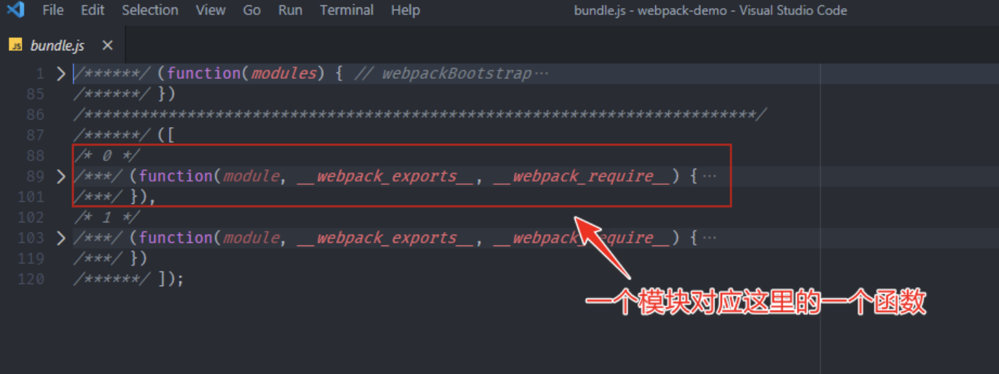
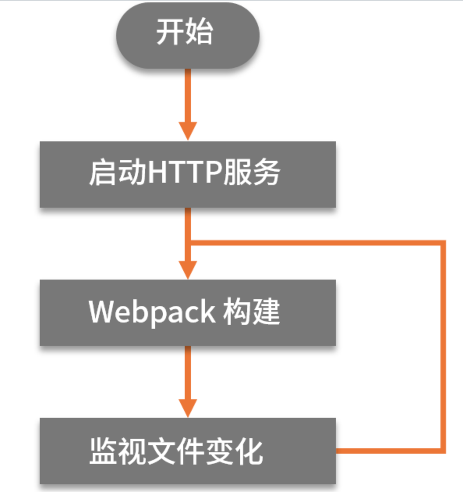
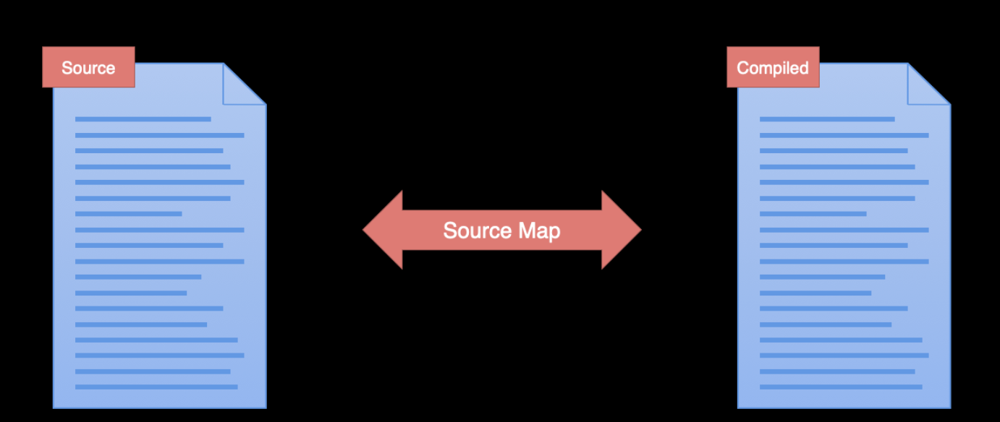
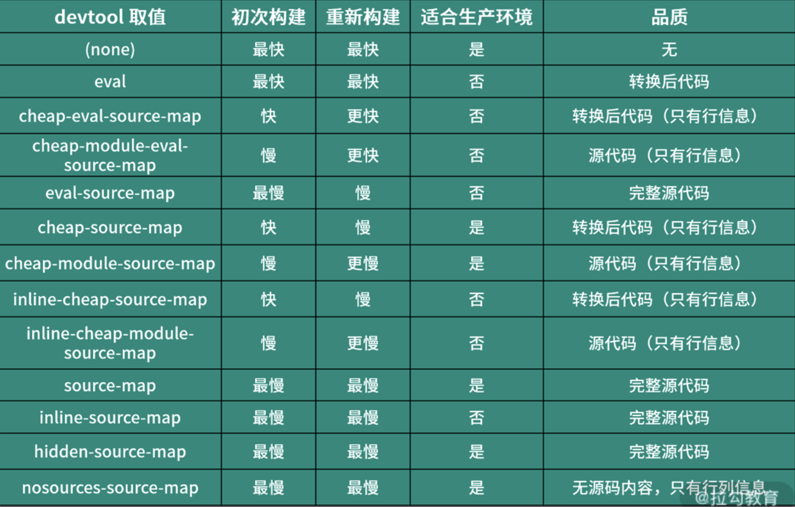
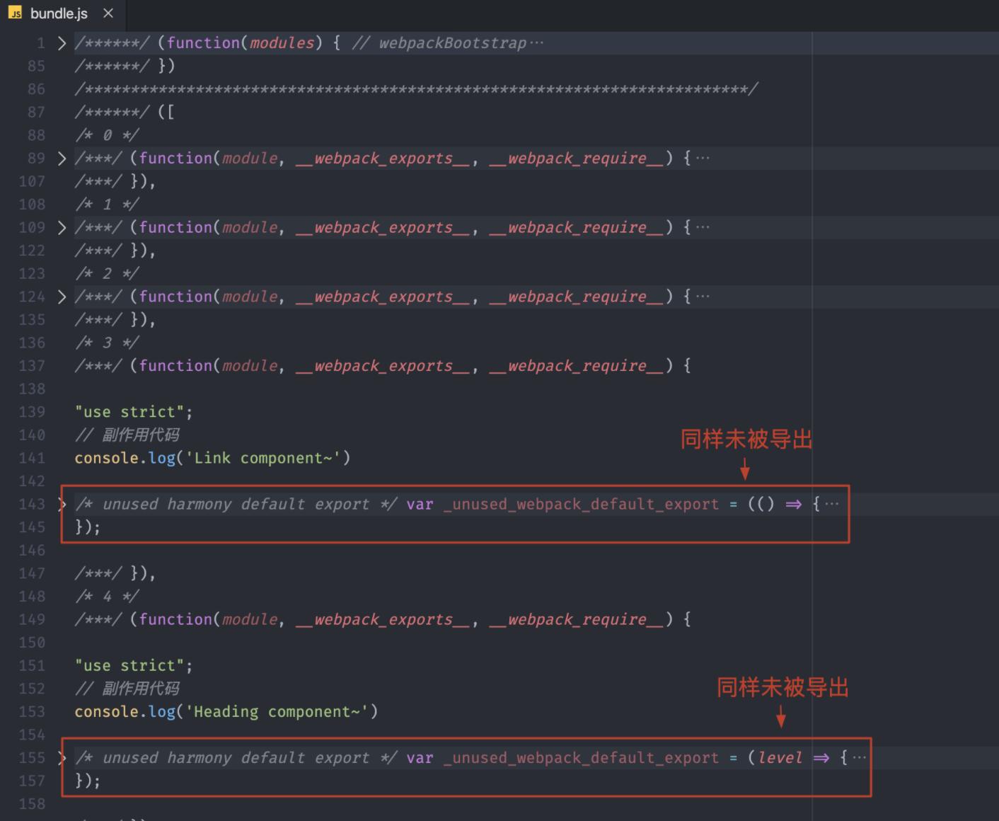
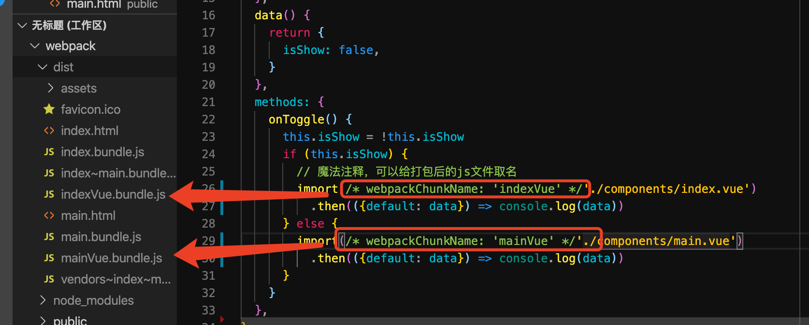

## Webpack学习-深入浅出

### 简介

> **webpack** 是一个用于现代 JavaScript 应用程序的*静态模块打包工具*

+ Webpack是提升前端生产力的利器

  `个人觉得 Webpack 应该是现代化前端开发的基石，也是目前前端生产力的代名词。`

+ Webpack 与模块化开发

  `随着前端应用的日益复杂化，我们的项目已经逐渐膨胀到了不得不花大量时间去管理的程度。而模块化就是一种最主流的项目组织方式，它通过把复杂的代码按照功能划分为不同的模块单独维护，从而提高开发效率、降低维护成本。`

### Webpack核心特点

#### 使用 Webpack 实现模块化打包

目前，前端领域有一些工具能够很好的满足以上这 3 个需求，其中最为主流的就是 Webpack、Parcel 和 Rollup，我们以 Webpack 为例：

+ Webpack 作为一个模块打包工具，本身就可以解决模块化代码打包的问题，将零散的 JavaScript 代码打包到一个 JS 文件中。

+ 对于有环境兼容问题的代码，Webpack 可以在打包过程中通过 Loader 机制对其实现编译转换，然后再进行打包。

+ 对于不同类型的前端模块类型，Webpack 支持在 JavaScript 中以模块化的方式载入任意类型的资源文件，例如，我们可以通过 Webpack 实现在 JavaScript 中加载 CSS 文件，被加载的 CSS 文件将会通过 style 标签的方式工作。

##### Webpack 快速上手

安装 Webpack 的核心模块以及它的 CLI 模块，具体操作如下：

 ```bash
 npm init --yes
 npm i webpack webpack-cli --save-dev
 ```

> webpack 是 Webpack 的核心模块，webpack-cli 是 Webpack 的 CLI 程序，用来在命令行中调用 Webpack。

安装完成之后，webpack-cli 所提供的 CLI 程序就会出现在 node_modules/.bin 目录当中，我们可以通过 npx 快速找到 CLI 并运行它，具体操作如下：

``` bash
npx webpack --version

npx 是 npm 5.2 以后新增的一个命令，可以用来更方便的执行远程模块或者项目 node_modules 中的 CLI 程序。
```

运行 webpack 命令来打包 JS 模块代码，具体操作如下：

```bash
npx webpack
```

这个命令在执行的过程中，Webpack 会自动从 src/index.js 文件开始打包，然后根据代码中的模块导入操作，自动将所有用到的模块代码打包到一起。

对于 Webpack 最基本的使用，总结下来就是：先安装 webpack 相关的 npm 包，然后使用 webpack-cli 所提供的命令行工具进行打包。

##### 配置 Webpack 的打包过程

>详细的文档你可以在 Webpack 的官网中找到：https://webpack.js.org/configuration/#options

在这里，我想跟你分享我在编写 Webpack 配置文件时用过的一个小技巧，因为 Webpack 的配置项比较多，而且很多选项都支持不同类型的配置方式。即便没有使用 TypeScript 这种类型友好的语言，也可以通过类型注释的方式去标注变量的类型。

默认 VSCode 并不知道 Webpack 配置对象的类型，我们通过 import 的方式导入 Webpack 模块中的 Configuration 类型，然后根据类型注释的方式将变量标注为这个类型，这样我们在编写这个对象的内部结构时就可以有正确的智能提示了，具体代码如下所示：

```js
import { Configuration } from 'webpack' // 一定记得运行 Webpack 前先注释掉这里。
/**
 * @type {Configuration}
 */
   const config = {
     entry: './src/index.js',
     output: {
     filename: 'bundle.js'
     }
   }

module.exports = config
```


需要注意的是：我们添加的 import 语句只是为了导入 Webpack 配置对象的类型，这样做的目的是为了标注 config 对象的类型，从而实现智能提示。在配置完成后一定要记得注释掉这段辅助代码，因为在 Node.js 环境中默认还不支持 import 语句，如果执行这段代码会出现错误。

所以我一般的做法是直接在类型注释中使用 import 动态导入类型，具体代码如下：

```js
/** @type {import('webpack').Configuration} */
const config = {
  entry: './src/index.js',
  output: {
    filename: 'bundle.js'
  }
}
module.exports = config
```


这种方式同样也可以实现载入类型，而且相比于在代码中通过 import 语句导入类型更为方便，也更为合理。

不过需要注意一点，这种导入类型的方式并不是 ES Modules 中的 Dynamic Imports，而是 TypeScript 中提供特性。虽然我们这里只是一个 JavaScript 文件，但是在 VSCode 中的类型系统都是基于 TypeScript 的，所以可以直接按照这种方式使用，详细信息你可以参考这种 import-types 的文档。

其次，这种 @type 类型注释的方式是基于 JSDoc 实现的。JSDoc 中类型注释的用法还有很多，详细可以参考官方文档中对 @type 标签的介绍。https://jsdoc.app/index.html

#####Webpack 工作模式

> https://webpack.js.org/configuration/mode/

Webpack 4 新增了一个工作模式的用法，这种用法大大简化了 Webpack 配置的复杂程度。你可以把它理解为针对不同环境的几组预设配置：

+ production 模式下，启动内置优化插件，自动优化打包结果，打包速度偏慢；
+ development 模式下，自动优化打包速度，添加一些调试过程中的辅助插件；
+ none 模式下，运行最原始的打包，不做任何额外处理。

针对工作模式的选项，如果你没有配置一个明确的值，打包过程中命令行终端会打印一个对应的配置警告。在这种情况下 Webpack 将默认使用 production 模式去工作。

修改 Webpack 工作模式的方式有两种：

+ 通过 CLI --mode 参数传入；
+ 通过配置文件设置 mode 属性。

打包结果运行原理
最后，我们来一起学习 Webpack 打包后生成的 bundle.js 文件，深入了解 Webpack 是如何把这些模块合并到一起，而且还能正常工作的。

为了更好的理解打包后的代码，我们先将 Webpack 工作模式设置为 none，这样 Webpack 就会按照最原始的状态进行打包，所得到的结果更容易理解和阅读。

按照 none 模式打包完成后，我们打开最终生成的 bundle.js 文件，如下图所示：


我们可以先把代码全部折叠起来，以便于了解整体的结构，如下图所示：

> VSCode 中折叠代码的快捷键是 Ctrl + K，Ctrl + 0(macOS：Command + K,Command + 0)


整体生成的代码其实就是一个立即执行函数，这个函数是 Webpack 工作入口（webpackBootstrap），它接收一个 modules 参数，调用时传入了一个数组。

展开这个数组，里面的元素均是参数列表相同的函数。这里的函数对应的就是我们源代码中的模块，也就是说每个模块最终被包裹到了这样一个函数中，从而实现模块私有作用域，如下图所示：



我们再来展开 Webpack 工作入口函数，如下图所示：


这个函数内部并不复杂，而且注释也很清晰，最开始定义了一个 installedModules 对象用于存放或者缓存加载过的模块。紧接着定义了一个 require 函数，顾名思义，这个函数是用来加载模块的。再往后就是在 require 函数上挂载了一些其他的数据和工具函数，这些暂时不用关心。

这个函数执行到最后调用了 require 函数，传入的模块 id 为 0，开始加载模块。模块 id 实际上就是模块数组的元素下标，也就是说这里开始加载源代码中所谓的入口模块。

为了更好的理解 bundle.js 的执行过程，可以把它运行到浏览器中，然后通过 Chrome 的 Devtools 单步调试一下。

#####Webpack 运行机制

**Webpack 核心工作过程中的关键环节**：

+ Webpack CLI 启动打包流程；
+ 载入 Webpack 核心模块，创建 Compiler 对象；
  + webpack核心模块会根据配置选项去构建compiler对象，可分多路打包和单路打包。
  + 多路打包相当与再次调用webpack函数，通过MultiCompiler类获得compiler对象；单路打包会解析配置选项覆盖默认选项，接着通过Compiler类获得compiler对象，将解析好的options配置对象挂载到compiler上。
  + 紧接着注册已配置的插件，调用环境变量钩子和注册内置的插件
  + 最后返回compiler对象
+ 使用 Compiler 对象开始编译整个项目；
  + 执行compiler对象的run方法，会先触发beforeRun和run钩子，再执行compile方法（也就是Compiler类的compile方法），开始真正的编译。
  + 触发beforeCompile和compile钩子，创建compilation上下文对象，再触发make钩子，开始`make`阶段。
+ 从入口文件开始，解析模块依赖，形成依赖关系树；
+ 递归依赖树，将每个模块交给对应的 Loader 处理；
+ 合并 Loader 处理完的结果，将打包结果输出到 dist 目录。


**对于 make 阶段后续的基本流程**：

- SingleEntryPlugin 中调用了 Compilation 对象的 addEntry 方法，开始解析入口；
- addEntry 方法中又调用了 _addModuleChain 方法，将入口模块添加到模块依赖列表中；
- 紧接着通过 Compilation 对象的 buildModule 方法进行模块构建；
- buildModule 方法中执行具体的 Loader，处理特殊资源加载；
- build 完成过后，通过 acorn 库生成模块代码的 AST 语法树；
- 根据语法树分析这个模块是否还有依赖的模块，如果有则继续循环 build 每个依赖；
- 所有依赖解析完成，build 阶段结束；
- 最后合并生成需要输出的 bundle.js 写入 dist 目录。

#### webpack高阶

#####DevServer提高开发效率

我们在开发过程中需要时时的看我们的编写结果，我们比较原始的方式就是以 watch 模式工作`修改代码 → Webpack 自动打包 → 手动刷新浏览器(http-serve) → 预览运行结果`，或者使用BrowserSync工具替换 serve 工具，启动 HTTP 服务，这里还需要同时监听 dist 目录下文件的变化，具体命令如下：

```bash
# 可以先通过 npm 全局安装 browser-sync 模块，然后再使用这个模块
$ npm install browser-sync --global
$ browser-sync dist --watch

# 或者也可以使用 npx 直接使用远端模块
$ npx browser-sync dist --watch

```

它的原理就是 Webpack 监视源代码变化，自动打包源代码到 dist 中，而 dist 中文件的变化又被 BrowserSync 监听了，从而实现自动编译并且自动刷新浏览器的功能，整个过程由两个工具分别监视不同的内容。

这种 watch 模式 + BrowserSync 虽然也实现了我们的需求，但是这种方法有很多弊端：

+ 操作烦琐，我们需要同时使用两个工具，那么需要了解的内容就会更多，学习成本大大提高；

+ 效率低下，因为整个过程中， Webpack 会将文件写入磁盘，BrowserSync 再进行读取。过程中涉及大量磁盘读写操作，必然会导致效率低下。
  所以这只能算是“曲线救国”，并不完美，我们仍然需要继续改善。

所以我们可以使用`webpack-dev-server `，它 Webpack 官方推出的一款开发工具，根据它的名字我们就应该知道，它提供了一个开发服务器，并且将自动编译和自动刷新浏览器等一系列对开发友好的功能全部集成在了一起。

```bash
# 安装 webpack-dev-server
$ npm install webpack-dev-server --save-dev
# 运行 webpack-dev-server
$ npx webpack-dev-server
```

webpack-dev-server 为了提高工作速率，它并没有将打包结果写入到磁盘中，而是暂时存放在内存中，内部的 HTTP Server 也是从`内存`中读取这些文件的。这样一来，就会减少很多不必要的磁盘读写操作，大大提高了整体的构建效率。

Webpack 配置对象中可以有一个叫作 devServer 的属性，专门用来为 webpack-dev-server 提供配置，具体如下：

```js
// ./webpack.config.js
const path = require('path')

module.exports = {
  // ...
  devServer: {
    contentBase: 'pulic', // 指定额外的静态资源路径
    compress: true, // 开启压缩
    port: 9000, // 指定端口，默认8080
    // ...
    // 详细配置文档：https://webpack.js.org/configuration/dev-server/
  }
}

```

*Proxy 代理解决开发跨域*

```js
// ./webpack.config.js
module.exports = {
  // ...
  devServer: {
    proxy: {
      '/api': {
        target: 'https://api.github.com', // 目标地址
        pathRewrite: {
          '^/api': '' // 替换掉代理地址中的 /api
        },
        changeOrigin: true // 确保请求 GitHub 的主机名就是：api.github.com
      }
    }
  }
}
```

+ pathRewrite ：最终会以正则的方式来替换请求路径，如果不像上文配置，那此时我们请求 http://localhost:8080/api/users ，就相当于请求了 https://api.github.com/api/users
+ changeOrigin ：属性设置为 true，就会以实际代理请求地址中的主机名去请求

##### Source Map配置

*原理：*

Source Map（源代码地图）就是解决此类问题最好的办法，从它的名字就能够看出它的作用：映射转换后的代码与源代码之间的关系。一段转换后的代码，通过转换过程中生成的 Source Map 文件就可以逆向解析得到对应的源代码。

.map是一个 JSON 格式的文件，为了更容易阅读，我提前对该文件进行了格式化。这个 JSON 里面记录的就是转换后和转换前代码之间的映射关系，主要存在以下几个属性：

+ version 是指定所使用的 Source Map 标准版本；
+ sources 中记录的是转换前的源文件名称，因为有可能出现多个文件打包转换为一个文件的情况，所以这里是一个数组；
+ names 是源代码中使用的一些成员名称，我们都知道一般压缩代码时会将我们开发阶段编写的有意义的变量名替换为一些简短的字符，这个属性中记录的就是原始的名称；
+ mappings 属性，这个属性最为关键，它是一个叫作 base64-VLQ 编码的字符串，里面记录的信息就是转换后代码中的字符与转换前代码中的字符之间的映射关系，具体如下图所示：


一般我们会在转换后的代码中通过添加一行注释的方式来去引入 Source Map 文件。不过这个特性只是用于开发调试的，所以最新版本的 jQuery 已经去除了引入 Source Map 的注释，我们需要手动添加回来，这里我们在最后一行添加 `//# sourceMappingURL=jquery-3.4.1.min.map`，具体效果如下：

*配置：*

```js
// ./webpack.config.js
module.exports = {
  devtool: 'source-map' // source map 设置
}
```

Webpack 中的 devtool 配置，除了可以使用 source-map 这个值，它还支持很多其他的选项，具体的我们可以参考文档中的不同模式的对比表。

根据上图，总结得出：

+ eval（不生产.map文件，在打包后js模块中）：Webpack 会将每个模块转换后的代码都放到 eval 函数中执行，并且通过 sourceURL 声明对应的文件路径。``它只能定位源代码的文件路径，无法知道具体的行列信息``
+ inline-source-map：它跟普通的 source-map 效果相同，只不过这种模式下 Source Map 文件不是以物理文件存在，而是以 data URLs 的方式出现在代码中。我们前面遇到的 eval-source-map 也是这种 inline 的方式。
+ hidden-source-map ：在这个模式下，我们在开发工具中看不到 Source Map 的效果，但是它也确实生成了 Source Map 文件，这就跟 jQuery 一样，虽然生成了 Source Map 文件，但是代码中并没有引用对应的 Source Map 文件，开发者可以自己选择使用。
+ nosources-source-map ：在这个模式下，我们能看到错误出现的位置（包含行列位置），但是点进去却看不到源代码。这是为了保护源代码在生产环境中不暴露。
+ 其他可得出`cheap: 只能定位到行，定位不到列；module：让源代码不转化（不经过Loader） ES6 写法，保持原本写法`

我个人平时开发会选：`cheap-module-eval-source-map`，而发布前打包则选择 `none`不代码映射。

##### 热替换（HMR）机制

配置代码如下：

```js
// ./webpack.config.js
const webpack = require('webpack')

module.exports = {
  // ...
  devServer: {
    // 开启 HMR 特性，如果资源不支持 HMR 会 fallback 到 live reloading
    hot: true
    // 只使用 HMR，不会 fallback 到 live reloading,这样热替换逻辑中的错误信息就可以直接看到（不页面刷新）
    // hotOnly: true
  },
  plugins: [
    // ...
    // HMR 特性所需要的插件
    new webpack.HotModuleReplacementPlugin()
  ]
}
```

当我们还是需要自己手动通过代码来处理，可以使用HotModuleReplacementPlugin 为我们的 JavaScript 提供了一套用于处理 HMR 的 API，我们需要在我们自己的代码中，使用这套 API 将更新后的模块替换到正在运行的页面中。

```js
// HMR -----------------------------------
if (module.hot) { // 确保有 HMR API 对象
  module.hot.accept('./sourceUrl', () => {
    // ...
		console.log('更新了')
  })
}
```

##### 高级特性优化项目

######*Tree Shaking*

> Tree-shaking 并不是指 Webpack 中的某一个配置选项，而是一组功能搭配使用过后实现的效果，这组功能在生产模式下都会自动启用，所以使用生产模式打包就会有 Tree-shaking 的效果。

功能：移除未引用代码（dead-code）

配置：

```js
// ./webpack.config.js
module.exports = {
  // ... 其他配置项
  optimization: {
    // 模块只导出被使用的成员(未开启压缩还可以在模块中看到)
    usedExports: true,
    // 压缩输出结果
    minimize: true,
    // 尽可能合并每一个模块到一个函数中，这个特性又被称为 Scope Hoisting，也就是作用域提升，它是 Webpack 3.0 中添加的一个特性。
    concatenateModules: true,
  }
}
```

注意：*结合 babel-loader 的问题*

Tree-shaking 实现的前提是 ES Modules，也就是说：最终交给 Webpack 打包的代码，必须是使用 ES Modules 的方式来组织的模块化。

我们为了更好的兼容性，会选择使用 babel-loader 去转换我们源代码中的一些 ECMAScript 的新特性。而 Babel 在转换 JS 代码时，很有可能处理掉我们代码中的 ES Modules 部分，把它们转换成 CommonJS 的方式。

`但在最新版本（8.x）的 babel-loader 中，已经自动帮我们关闭了对 ES Modules 转换的插件，所以我们只需要注意我们的 babel-loader的版本即可`

```js
// ./webpack.config.js
module.exports = {
  mode: 'none',
  entry: './src/main.js',
  output: {
    filename: 'bundle.js'
  },
  module: {
    rules: [
      {
        test: /\.js$/,
        use: {
          loader: 'babel-loader',
          options: {
            presets: [
              ['@babel/preset-env']
              // 强制使用 Babel 的 ES Modules 插件把代码中的 ES Modules 转换为 CommonJS
              // ['@babel/preset-env', { modules: 'commonjs' }]
            ]
          }
        }
      }
    ]
  },
  optimization: {
    usedExports: true
  }
}
```

######*sideEffects*

> 允许我们通过配置标识我们的代码是否有副作用，从而提供更大的压缩空间。模块的副作用指的就是模块执行的时候除了导出成员，是否还做了其他的事情。

开启 Tree-shaking 特性（只设置 useExports），这里没有用到的导出成员被移除，打包效果如下：

但是由于这些成员所属的模块中有副作用代码，所以就导致最终 Tree-shaking 过后，这些模块并不会被完全移除。所以说，`Tree-shaking 只能移除没有用到的代码成员，而想要完整移除没有用到的模块，那就需要开启 sideEffects 特性了。`

`配置：`

```js
// ./webpack.config.js
module.exports = {
  mode: 'none',
  entry: './src/main.js',
  output: {
    filename: 'bundle.js'
  },
  optimization: {
    // 在 production 模式下同样会自动开启
    sideEffects: true
  }
}
```

Webpack 在打包某个模块之前，会先检查这个模块所属的 package.json 中的 sideEffects 标识，以此来判断这个模块是否有副作用，如果没有副作用的话，这些没用到的模块就不再被打包。换句话说，即便这些没有用到的模块中存在一些副作用代码，我们也可以通过 package.json 中的 sideEffects 去强制声明没有副作用。

```json
// package.json
{
  "name": "09-side-effects",
  "version": "0.1.0",
  "author": "zce <w@zce.me> (https://zce.me)",
  "license": "MIT",
  "scripts": {
    "build": "webpack"
  },
  "devDependencies": {
    "webpack": "^4.43.0",
    "webpack-cli": "^3.3.11"
  },
  // 项目中的所有代码都没有副作用,webpack就会将所有未导出模块副作用代码删除
  "sideEffects": false
  // 可以指定保留有副作用的模块路径（可以使用通配符）
  //"sideEffects": [
  //  "./src/extend.js",
  //  "*.css"
  // ]
}
```

总结sideEffects配置：

+ webpack.config.js 中的 sideEffects 用来开启这个功能；
+ package.json 中的 sideEffects 用来标识我们的代码没有副作用。

不管是 Tree-shaking 还是 sideEffects，我个人认为，它们都是为了弥补 JavaScript 早期在模块系统设计上的不足。随着 Webpack 这类技术的发展，JavaScript 的模块化确实越来越好用，也越来越合理。

除此之外，我还想说一点，在开发过程中应该意识到：`尽可能不要写影响全局的副作用代码。`

######*Code Splitting（分块打包）*

原因：`All in One 的弊端`,如果我们的应用非常复杂，模块非常多，那么这种 All in One 的方式就会导致打包的结果过大，甚至超过 4～5M。

在绝大多数的情况下，应用刚开始工作时，并不是所有的模块都是必需的。如果这些模块全部被打包到一起，即便应用只需要一两个模块工作，也必须先把 bundle.js 整体加载进来，而且前端应用一般都是运行在浏览器端，这也就意味着应用的响应速度会受到影响，也会浪费大量的流量和带宽。

更为合理的方案是`把打包的结果按照一定的规则分离到多个 bundle 中，然后根据应用的运行需要按需加载`。这样就可以降低启动成本，提高响应速度。

可能有同学会疑问，webpack不就是要把多个模块打包一起吗？现在又要拆开？原因很简单：`Web 应用中的资源受环境所限，太大不行，太碎更不行`。因为我们开发过程中划分模块的颗粒度一般都会非常的细，很多时候一个模块只是提供了一个小工具函数，并不能形成一个完整的功能单元。

而且，目前主流的 HTTP 1.1 本身就存在一些缺陷，例如：

+ 同一个域名下的`并行请求`是有限制的；
+ 每次请求本身都会有一定的`延迟`；
+ 每次请求除了传输内容，还有额外的`请求头`，大量请求的情况下，这些请求头加在一起也会浪费流量和带宽。

实现方案：

+ 根据业务不同配置多个打包入口，输出多个打包结果；
+ 结合 ES Modules 的动态导入（Dynamic Imports）特性，按需加载模块。

*多入口打包配置*：

```js
// ./webpack.config.js
const HtmlWebpackPlugin = require('html-webpack-plugin')
module.exports = {
  entry: {
    index: './src/index.js',
    main: './src/main.js'
  },
  output: {
    filename: '[name].bundle.js' // [name] 是入口名称
  },
  // ... 其他配置
  plugins: [
    new HtmlWebpackPlugin({
      title: 'Multi Entry',
      template: './src/index.html',
      filename: 'index.html',
      chunks: ['index'] // 指定使用 index.bundle.js
    }),
    new HtmlWebpackPlugin({
      title: 'Multi Entry',
      template: './src/main.html',
      filename: 'main.html',
      chunks: ['main'] // 指定使用 main.bundle.js
    })
  ],
  optimization: {
    splitChunks: {
      // 自动提取所有公共模块到单独 bundle
      chunks: 'all'
    }
  }
}
```

*动态导入*

> 为了动态导入模块，可以将 import 关键字作为函数调用。当以这种方式使用时，import 函数返回一个 Promise 对象。这就是 ES Modules 标准中的 Dynamic Imports。



```js
// ./src/App.vue
export default {
  components: {
    Home,
  },
  data() {
    return {
      isShow: false,
    }
  },
  methods: {
    onToggle() {
      this.isShow = !this.isShow
      if (this.isShow) {
        // 魔法注释，可以给打包后的js文件取名
        import(/* webpackChunkName: 'indexVue' */'./components/index.vue').then(({default: data}) => console.log(data))
      } else {
        import(/* webpackChunkName: 'mainVue' */'./components/main.vue').then(({default: data}) => console.log(data))
      }
    }
  },
}
</script>
```

##### 优化Webpack的构建速度和打包结果

我们先为不同的工作环境创建不同的 Webpack 配置。创建不同环境配置的方式主要有两种：

+ 在配置文件中添加相应的判断条件，根据环境不同导出不同配置。

```bash
// 终端命令
// 项目打包
webpack --env=production
// 项目启动
webpack-dev-server --env=development
```

```js
// webpack.config.js
module.exports = (env, argv) => {
    const config = {
        // ... 不同模式下的公共配置
    }

    if (env === 'development') {
      // 为 config 添加开发模式下的特殊配置
      config.mode = 'development'
      config.devtool = 'cheap-eval-module-source-map'
    } else if (env === 'production') {
      // 为 config 添加生产模式下的特殊配置
      config.mode = 'production'
      config.devtool = 'none'
    }
    
    return config
}
```

+ 为不同环境单独添加一个配置文件，一个环境对应一个配置文件。

一般在这种方式下，项目中最少会有三个 webpack 的配置文件。其中两个用来分别适配开发环境和生产环境，另外一个则是公共配置。因为开发环境和生产环境的配置并不是完全不同的，所以需要一个公共文件来抽象两者相同的配置。具体配置文件结构如下：

```
├── webpack.common.js ···························· 公共配置
├── webpack.dev.js ······························· 开发模式配置
└── webpack.prod.js ······························ 生产模式配置
```

合并对象，覆盖公共的配置对象我们可以使用Object.assign，或者使用 Lodash 提供的 merge 函数来实现，不过社区中提供了更为专业的模块 webpack-merge，它专门用来满足我们这里合并 Webpack 配置的需求。

我们可以先通过 npm 安装一下 webpack-merge 模块。具体命令如下：

```bash
$ npm i webpack-merge --save-dev 
$ yarn add webpack-merge --dev
```

```js
// ./webpack.common.js
module.exports = {
  // ... 公共配置
}
// ./webpack.prod.js
const merge = require('webpack-merge')
const common = require('./webpack.common')
module.exports = merge(common, {
  // 生产模式配置
})
// ./webpack.dev.jss
const merge = require('webpack-merge')
const common = require('./webpack.common')
module.exports = merge(common, {
  // 开发模式配置
})
```

分别配置完成过后，我们再次回到命令行终端，然后尝试运行 webpack 打包。不过因为这里已经没有默认的配置文件了，所以我们需要通过 --config 参数来指定我们所使用的配置文件路径。例如：

```bash
$ webpack --config webpack.prod.js
```

*生产模式下的优化插件*

+ Define Plugin：为代码中注入全局成员

```js
// ./webpack.config.js
const webpack = require('webpack')
module.exports = {
  // ... 其他配置
  plugins: [
    new webpack.DefinePlugin({
      // 值要求的是一个代码片段（如果只是字符串的，调用就会变成变量报错）
      API_BASE_URL: JSON.stringify('https://api.example.com')
    })
  ]
}

// ./src/main.js
console.log(API_BASE_URL) // https://api.example.com
```

+ Mini CSS Extract Plugin：可以将 CSS 代码从打包结果中提取出来的插件
+ Optimize CSS Assets Webpack Plugin: 压缩CSS文件

> CSS 体积不是很大的话，提取到单个文件中，效果可能适得其反，因为单独的文件就需要单独请求一次。个人认为是如果 CSS 超过*200KB*才需要考虑是否提取出来，作为单独的文件。

安装：

```bash
$ npm i mini-css-extract-plugin --save-dev
$ npm i optimize-css-assets-webpack-plugin --save-dev
```

使用：

```js
// ./webpack.config.js
const MiniCssExtractPlugin = require('mini-css-extract-plugin')
const OptimizeCssAssetsWebpackPlugin = require('optimize-css-assets-webpack-plugin')
module.exports = {
  mode: 'none',
  entry: {
    main: './src/index.js'
  },
  output: {
    filename: '[name].bundle.js'
  },
  module: {
    rules: [
      {
        test: /\.css$/,
        use: [
          // 'style-loader', // 将样式通过 style 标签注入
          MiniCssExtractPlugin.loader,//样式就会存放在独立的文件中，直接通过 link 标签引入页面, CSS样式不会压缩，只会压缩js代码
          'css-loader'
        ]
      }
    ]
  },
  plugins: [
    new MiniCssExtractPlugin(),
    new OptimizeCssAssetsWebpackPlugin() // 压缩css代码
  ]
}
```

优化压缩：

> 如果我们配置到 plugins 属性中，那么这个插件在任何情况下都会工作。而配置到 minimizer 中，就只会在 minimize 特性开启时才工作

需额外安装内置的 JS 压缩插件叫作 terser-webpack-plugin，因为我们设置了 minimizer，Webpack 认为我们需要使用`自定义压缩器插件`，那内部的 JS 压缩器就会被覆盖掉

```bash
$ npm i terser-webpack-plugin --save-dev
```

使用：

```js
// ./webpack.config.js
const MiniCssExtractPlugin = require('mini-css-extract-plugin')
const OptimizeCssAssetsWebpackPlugin = require('optimize-css-assets-webpack-plugin')
const TerserWebpackPlugin = require('terser-webpack-plugin')
module.exports = {
	...
  optimization: {
    minimize: true, // 压缩功能需要开启，生产可不需要
    minimizer: [
      new TerserWebpackPlugin(),
      new OptimizeCssAssetsWebpackPlugin()
    ]
  },
  module: {
    rules: [
      {
        test: /\.css$/,
        use: [
          MiniCssExtractPlugin.loader,
          'css-loader'
        ]
      }
    ]
  },
  plugins: [
    new MiniCssExtractPlugin()
  ]
}
```

### 其他打包工具

#### Rollup

Rollup 是一款 ES Modules 打包器。它也可以将项目中散落的细小模块打包为整块代码，从而使得这些划分的模块可以更好地运行在浏览器环境或者 Node.js 环境。它的初衷只是希望能够`提供一个高效的 ES Modules 打包器，充分利用 ES Modules 的各项特性，构建出结构扁平，性能出众的类库。`

*安装*

```bash
npm i rollup --save-dev
```

*准备结构*

```
.
├── src
│   ├── index.js
│   ├── logger.js
│   └── messages.js
└── package.json
```

*示例代码*

```js
// ./src/messages.js
export default {
  hi: 'Hey Guys, I am zce~'
}
// ./src/logger.js
export const log = msg => {
  console.log('---------- INFO ----------')
  console.log(msg)
  console.log('--------------------------')
}
export const error = msg => {
  console.error('---------- ERROR ----------')
  console.error(msg)
  console.error('---------------------------')
}
// ./src/index.js
import { log } from './logger'
import messages from './messages'
log(messages.hi)
```

*打包*

```bash
npx rollup ./src/index.js --file ./dist/bundle.js
```

>  Rollup 默认会自动开启 Tree-shaking 优化输出结果，Tree-shaking 的概念最早也就是 Rollup 这个工具提出的。

我们也可以配置文件, 而不再命令行写

```
 .
 ├── src
 │   ├── index.js
 │   ├── logger.js
 │   └── messages.js
 ├── package.json
+└── rollup.config.js
```

*文件配置*

```js
// ./rollup.config.js
export default {
  input: 'src/index.js',
  output: {
    file: 'dist/bundle.js',
    format: 'es' // 输出格式
  }
}

or

// ./rollup.config.js
// 所有 Rollup 支持的格式
const formats = ['es', 'amd', 'cjs', 'iife', 'umd', 'system']
export default formats.map(format => ({
  input: 'src/index.js',
  output: {
    file: `dist/bundle.${format}.js`,
    format
  }
}))
```

*执行命令*

```bash
$ npx rollup --config # 使用默认配置文件
$ npx rollup --config rollup.prod.js # 指定配置文件路径
```

*使用插件*

Rollup 自身的功能就只是 ES Modules 模块的合并，如果有更高级的要求，例如加载其他类型的资源文件或者支持导入 CommonJS 模块，又或是编译 ES 新特性，这些额外的需求 Rollup 同样支持使用插件去扩展实现。

Webpack 中划分了 Loader、Plugin 和 Minimizer 三种扩展方式，而插件是 Rollup 的唯一的扩展方式。

这里我们先来尝试使用一个可以让我们在代码中导入 JSON 文件的插件：@rollup/plugin-json，通过这个过程来了解如何在 Rollup 中使用插件。

首先我们需要将 @rollup/plugin-json 作为项目的开发依赖安装进来。具体安装命令：

```bash
$ npm i @rollup/plugin-json --save-dev
```

安装完成过后，我们打开配置文件。由于 rollup 的配置文件中可以直接使用 ES Modules，所以我们这里使用 import 导入这个插件模块。具体代码如下：

```js
// ./rollup.config.js
import json from '@rollup/plugin-json'
export default {
  input: 'src/index.js',
  output: {
    file: 'dist/bundle.js',
    format: 'es'
  },
  plugins: [
    json()
  ]
}

```

插件使用方法基本一致，再提两个功能插件：

```bash
// Rollup 默认只能够按照文件路径的方式加载本地的模块文件，该包直接通过模块名称直接导入
// 加载 NPM 模块
$ npm i @rollup/plugin-node-resolve --save-dev

// 目前大量的 NPM 模块还是使用 CommonJS 方式导出成员，所以为了兼容这些模块
// 加载 CommonJS 模块
$ npm i @rollup/plugin-commonjs --save-dev
```

*Code Splitting*

Rollup 的最新版本中已经开始支持代码拆分了。我们同样可以使用符合 ES Modules 标准的动态导入方式实现模块的按需加载。例如：

```js
// ./src/index.js
// 动态导入的模块会自动分包
import('./logger').then(({ log }) => {
  log('code splitting~')
})

```

在 Rollup 在分包过后会输出多个 JS 文件，需要我们在配置中指定输出的目录，而不是一个具体的文件名，具体配置如下：

```js
// ./rollup.config.js
export default {
  input: 'src/index.js',
  output: {
    // file: 'dist/bundle.js', // code splitting 输出的是多个文件
    dir: 'dist',
    format: 'es'
  }
}

```

*优缺点*

 Rollup 确实有它的优势：

+ 输出结果更加扁平，执行效率更高；
+ 自动移除未引用代码；
+ 打包结果依然完全可读。

但是它的缺点也同样明显：

+ 加载非 ESM 的第三方模块比较复杂；
+ 因为模块最终都被打包到全局中，所以无法实现 HMR；
+ 浏览器环境中，代码拆分功能必须使用 Require.js 这样的 AMD 库

总结一下：`Webpack 大而全，Rollup 小而美。`

个人感觉：应用开发使用 Webpack，类库或者框架开发使用 Rollup。

不过这并不是绝对的标准，只是经验法则。因为 Rollup 也可用于构建绝大多数应用程序，而 Webpack 同样也可以构建类库或者框架。

另外随着近几年 Webpack 的发展，Rollup 中的很多优势几乎已经抹平了，所以这种对比慢慢地也就没有太大意义了。

#### Parcel

> Parcel 是一款完全零配置的前端打包器，它提供了 “傻瓜式” 的使用体验，我们只需了解它提供的几个简单的命令，就可以直接使用它去构建我们的前端应用程序了。

*准备目录*

```
.
├── src
│   ├── index.html
│   ├── logger.js
│   └── main.js
└── package.json

```

*安装*

```bash
$ npm install parcel-bundler --save-dev
```

*打包*

```bash
$ npx parcel src/index.html

// 生产模式打包
$ npx parcel build src/index.html
```

这里补充一点，相同体量的项目打包，Parcel 的构建速度会比 Webpack 快很多。因为 Parcel 内部使用的是`多进程`同时工作，充分发挥了多核 CPU 的性能。`Webpack 中也可以使用一个叫作 happypack 的插件实现这一点。`

> 虽然 Parcel 跟 Webpack 一样都支持以任意类型文件作为打包入口，不过 Parcel 官方还是建议我们使用 HTML 文件作为入口。官方的理由是 HTML 是应用在浏览器端运行时的入口。

*模块热替换*

```js
// ./src/main.js
import { log } from './logger'
log('hello parcel')
// HMR API
if (module.hot) {
  module.hot.accept(() => {
    console.log('HMR～')
  })
}

```

不过这里的 accept 方法与 Webpack 提供的 HMR 有点不太一样，Webpack 中的 accept 方法支持接收两个参数，用来处理指定的模块更新后的逻辑。

而这里 Parcel 提供的 accept 只需要接收一个回调参数，作用就是当前模块更新或者所依赖的模块更新过后自动执行传入的回调函数，这相比于之前 Webpack 中的用法要简单很多。

自动安装依赖

在文件保存过后，Parcel 会自动去安装刚刚导入的模块包，极大程度地避免手动操作。

*动态导入(code splitting)*

Parcel 同样支持直接使用动态导入，内部也会自动处理代码拆分

*核心特点*

+ 真正做到了完全零配置，对项目没有任何的侵入；
+ 自动安装依赖，开发过程更专注；
+ 构建速度更快，因为内部使用了多进程同时工作，能够充分发挥多核 CPU 的效率。

但是目前看来，如果你去观察开发者的实际使用情况，绝大多数项目的打包还是会选择 Webpack。个人认为原因有两点：

* Webpack 生态更好，扩展更丰富，出现问题容易解决；
* 随着这两年的发展，Webpack 越来越好用，开发者也越来越熟悉。